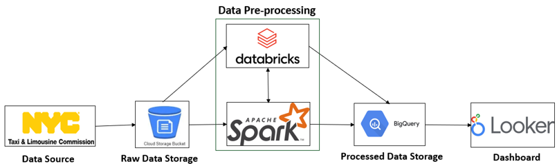

# NYC Trip Analysis Dashboard

This dashboard is created using trip record data provided by the Taxi and Limousine Commission from 2016 and beyond, amounting to a total of 615 million trip records. The dashboard has four pages in total, with the first page showing the overall analysis of trip dynamics in New York City, including the busiest pickup and drop-off locations, peak trip times, and fare variations throughout the day. It provides valuable insights into the traffic dynamics of NYC. Additionally, the other three pages are dedicated to Yellow taxis, green taxis, and for-hire vehicles like Uber, Lyft, Juno, and Via, providing various statistics for each of these taxi services. These insights are particularly useful for those looking to venture into the New York City taxi industry.

**Click the picture to to open the dashboard and try it out!**

.pdf))

# Methodology

As the data is huge, a big data pipeline is created, as shown below. For more information on how this pipeline works, please refer to the [manual](https://github.com/divisha-sunny/NYC-Trip-Analysis/blob/master/Manual.docx) attached in this repository.

